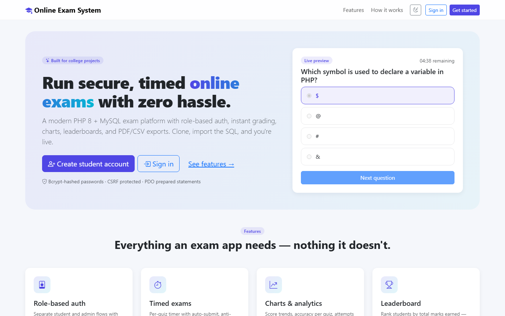
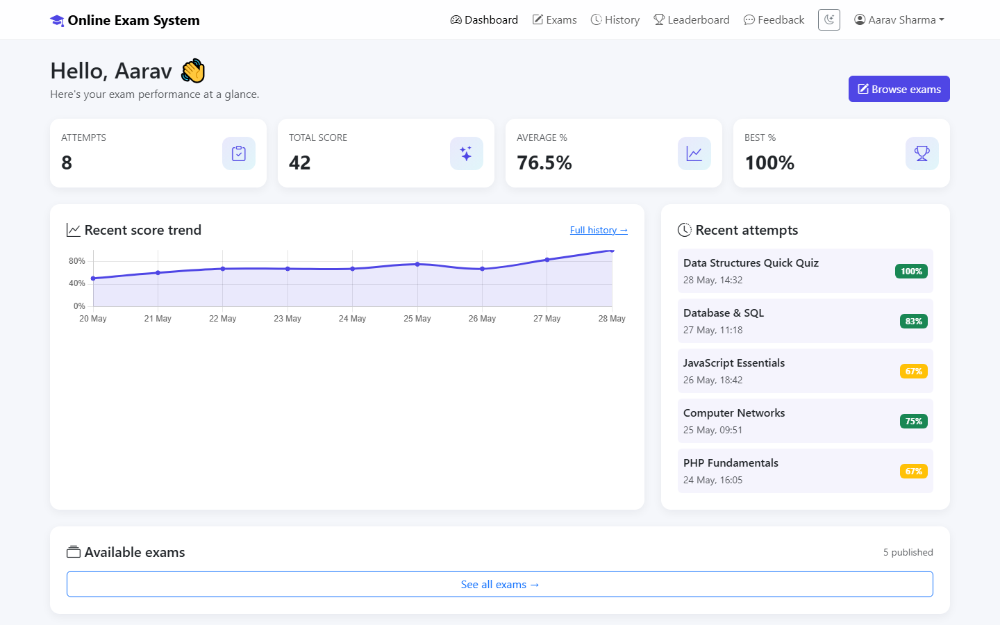
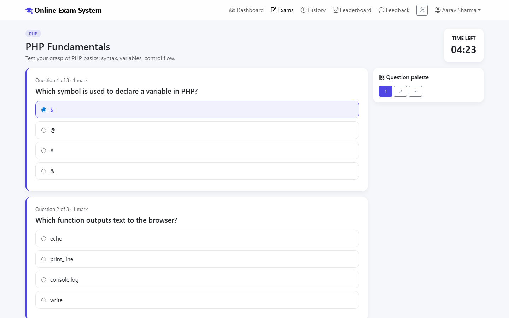
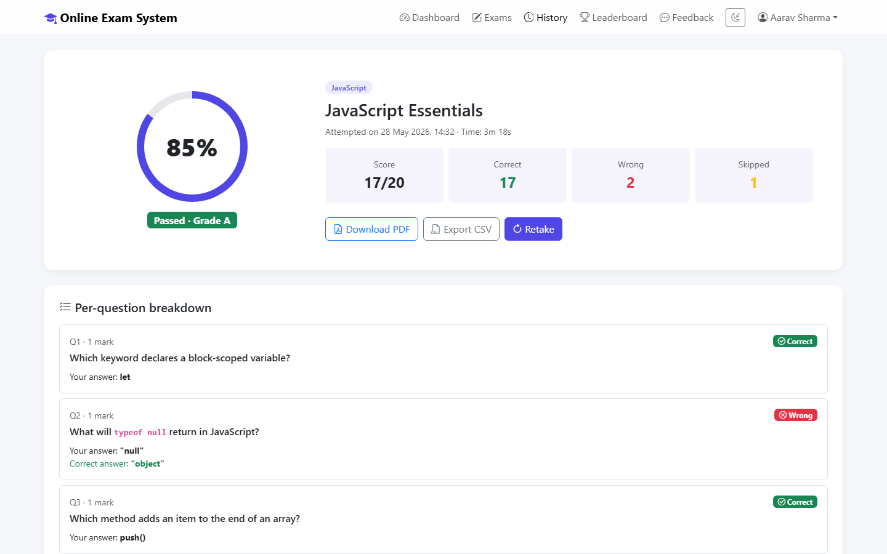
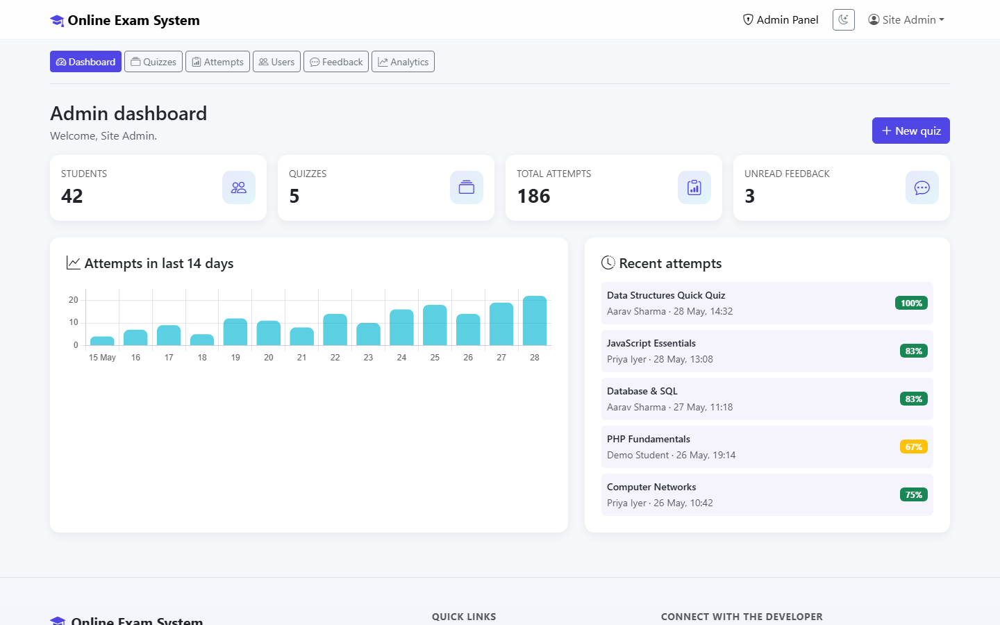
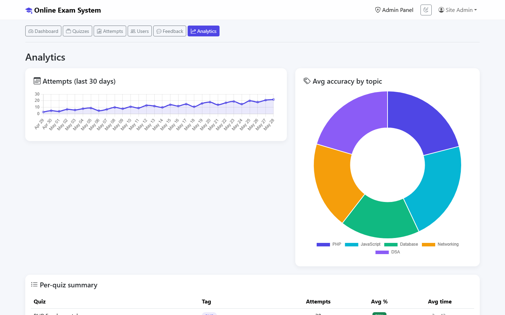

# 🎓 Online Exam System

> A modern, secure, **PHP 8 + MySQL** online examination platform — designed to be a great college mini-project and a clean, production-quality codebase to learn from.

[](https://www.php.net/)
[](https://www.mysql.com/)
[](https://getbootstrap.com/)
[](LICENSE)
[](#contributing)

---

## ✨ Features

- 🔐 **Role-based authentication** — separate student and admin flows, bcrypt-hashed passwords, CSRF protection, session regeneration on login.
- ⏱️ **Timed exams** — per-quiz countdown timer with auto-submit, anti-leave warning, and a question palette for jumping around.
- 🧠 **Instant grading & detailed breakdown** — see correct/wrong/skipped answers and the actual correct option per question.
- 📊 **Charts & analytics** — score trends, accuracy by topic, attempts-over-time (powered by Chart.js).
- 🏆 **Leaderboard** — global ranking by total marks earned.
- 📄 **PDF / CSV export** — print-ready PDF reports of any attempt + bulk CSV exports for admins.
- 🛠️ **Full admin panel** — CRUD for quizzes/questions, manage students, view all attempts, read feedback, system analytics.
- 🌗 **Dark / light mode** with theme persistence.
- 📱 **Mobile-friendly** Bootstrap 5 UI.
- 🛡️ **Secure by default** — PDO prepared statements everywhere, strict SQL mode, HTML escaping, CSRF tokens on every form.

---

## 🖼️ Screenshots

### Landing page
> Hero section with live exam preview + feature grid.



### Student dashboard
> At-a-glance KPI cards, score-trend chart (Chart.js), and recent attempts.



### Timed exam
> Sticky countdown timer, sticky question palette, and accessible radio options. Auto-submits at zero.



### Result page
> Animated score ring, pass/fail grade, per-question breakdown, and PDF / CSV export buttons.



### Admin dashboard
> System KPIs, 14-day attempts bar chart, and a live feed of recent attempts.



### Admin analytics
> 30-day attempts trend, accuracy doughnut by topic, and a per-quiz summary table.



---

## 🚀 Quick start (XAMPP / WAMP / MAMP)

This project was deliberately designed to require **no Composer, no Node, no build step**. If you've got XAMPP running, you can be live in under two minutes.

### 1. Clone into your web root

```bash
git clone https://github.com/aashishbharti04/online-exam-system.git
# Move it into your XAMPP htdocs (Windows example):
mv online-exam-system "/c/xampp/htdocs/online-exam-system"
```

### 2. Configure the database connection

Open [`config/config.php`](config/config.php) and verify the values match your local MySQL:

```php
const DB_HOST = '127.0.0.1';
const DB_PORT = 3306;
const DB_NAME = 'online_exam_system';
const DB_USER = 'root';
const DB_PASS = '';        // XAMPP default
```

> Prefer to keep secrets out of git? Create `config/config.local.php` with your overrides — it's gitignored.

### 3. Run the one-time installer

Start Apache + MySQL in XAMPP, then in your browser:

```
http://localhost/online-exam-system/install.php
```

The installer will:

1. Create the `online_exam_system` database
2. Import all tables + 5 sample quizzes (15 questions)
3. Create your **admin account** with a bcrypt-hashed password
4. Optionally create a demo student (`student@oes.local` / `student@123`)

When you're done, **delete `install.php`** from the server.

### 4. Sign in

- **Student**: <http://localhost/online-exam-system/login.php>
- **Admin**:   <http://localhost/online-exam-system/admin/login.php>

That's it. 🎉

---

## 🏗️ Project structure

```
online-exam-system/
├── index.php              Landing page (with feature tour)
├── install.php            One-time installer (delete after use)
├── login.php              Student sign-in
├── register.php           Student sign-up
├── logout.php
├── dashboard.php          Student dashboard (stats + trend chart)
├── exams.php              Browse / filter available exams
├── take-exam.php          Timed exam UI with question palette
├── submit-exam.php        Grading + persistence
├── result.php             Result page with detailed breakdown
├── history.php            All attempts + accuracy chart
├── leaderboard.php        Global top-50 ranking
├── profile.php            Edit profile + change password
├── feedback.php           Submit feedback / bug report
├── export.php             CSV + printable-PDF export
│
├── admin/                 Admin panel (role: admin)
│   ├── login.php
│   ├── dashboard.php      KPIs + attempts chart + recent activity
│   ├── quizzes.php        Quiz CRUD
│   ├── questions.php      Question CRUD with options
│   ├── attempts.php       View / filter / CSV-export all attempts
│   ├── users.php          Manage students (toggle, delete)
│   ├── feedback.php       Read & manage feedback
│   └── analytics.php      System-wide analytics
│
├── includes/              Shared PHP — db, auth, header, footer, helpers
├── config/                Application config
├── database/
│   └── schema.sql         Full schema + sample content
├── assets/
│   ├── css/style.css      Custom theme
│   ├── js/app.js          Timer, theme toggle, helpers
│   └── img/
└── uploads/               (reserved)
```

---

## 🗃️ Database schema

7 normalised tables with proper foreign keys, indexes, and `utf8mb4` charset:

| Table              | Purpose                                       |
| ------------------ | --------------------------------------------- |
| `users`            | Students + admins (role-based)                 |
| `quizzes`          | Quiz metadata (title, duration, passing %)     |
| `questions`        | Questions belonging to a quiz                  |
| `options`          | Choices for each question (one correct)        |
| `attempts`         | One row per submitted exam attempt             |
| `attempt_answers`  | Per-question record of what the student picked |
| `feedback`         | User feedback / bug reports                    |

Full DDL lives in [`database/schema.sql`](database/schema.sql).

---

## 🛡️ Security model

This project deliberately demonstrates a **modern, secure baseline** for PHP web apps:

- **Passwords** stored with `password_hash(PASSWORD_BCRYPT)` and verified with `password_verify`.
- **All SQL** uses **PDO prepared statements** — zero string interpolation into queries.
- **CSRF tokens** on every state-changing form (and verified server-side).
- **Session security**: HttpOnly + SameSite=Lax cookies, regeneration on login, distinct session name.
- **Output escaping**: every dynamic value goes through `htmlspecialchars(..., ENT_QUOTES)` via the `e()` helper.
- **Strict SQL mode** enabled at connection time.
- **Time-taken** is computed server-side (session-tracked) — students can't fake their timer client-side.

---

## 🧪 Default credentials

After running the installer, you can sign in with whatever you set up. If you accepted the defaults during install:

| Role    | Email               | Password      |
| ------- | ------------------- | ------------- |
| Admin   | _whatever you chose_ | _whatever you chose_ |
| Student | `student@oes.local` | `student@123` |

> ⚠️ **Change these in any non-local environment.**

---

## 🛠️ Tech stack

- **Backend**: PHP 8.0+, PDO
- **Database**: MySQL 5.7+ / MariaDB 10.3+
- **Frontend**: Bootstrap 5.3, Chart.js 4, vanilla JS
- **No build tools required** — Bootstrap and Chart.js are loaded from a CDN

---

## 🧩 Extending it

Some ideas to take this further as a college project:

- 📧 Email-based password reset (PHPMailer + SMTP)
- 🎲 Randomised question order per attempt
- 🖼️ Image-based questions (upload to `uploads/`)
- 🧮 Negative marking / weighted scoring
- 🌐 i18n with `gettext`
- 📤 Bulk import questions from CSV
- 🤝 Per-course / per-department quiz tagging
- 📡 REST API on top of the same DB for a future React/Vue frontend

PRs welcome — see [Contributing](#contributing) below.

---

## ❓ Troubleshooting

**"Database connection failed"**
→ Check `config/config.php` host/user/password match your MySQL setup. Default XAMPP has user `root` with no password.

**"Database unavailable" in production**
→ Set `APP_DEBUG = false` in config to hide the error details (and check `error_log`).

**"Invalid or expired CSRF token"**
→ Your session likely expired. Reload the form. If it persists, check that `session.save_path` is writable.

**Want to reset everything?**
→ In phpMyAdmin: drop the `online_exam_system` database, then re-run `install.php`.

---

## 🤝 Contributing

This codebase is intentionally readable and minimal — perfect for college students who want to learn PHP fundamentals and contribute back.

1. Fork the repo
2. Create a feature branch (`git checkout -b feat/awesome-thing`)
3. Commit (`git commit -m 'feat: add awesome thing'`)
4. Push (`git push origin feat/awesome-thing`)
5. Open a Pull Request

Issues, bug reports, and feature requests are all welcome.

---

## 📜 License

[MIT](LICENSE) — use it freely in your projects (yes, including your college submission). Attribution appreciated but not required.

---

## 💬 Credits

Built with ❤️ for students who deserve a clean starting point — not a 2015-era PHP tutorial.

If this helped your project, consider giving the repo a ⭐ on GitHub!

---

## 🌐 Connect with the developer

[](https://in.linkedin.com/in/aashana1012)
[](https://github.com/aashishbharti04)
[](https://www.youtube.com/@CodeWithAsur)
[](https://www.instagram.com/asurwave1012)
[](mailto:aashish@marketdoctorsonline.com)

📺 **Subscribe to [@CodeWithAsur](https://www.youtube.com/@CodeWithAsur)** for more PHP / full-stack web-dev tutorials and project walkthroughs!

---

<div align="center">

**© 2026 Online Exam System · Crafted by [Aashish Bharti](https://github.com/aashishbharti04)** &middot; Licensed under [MIT](LICENSE)

*All rights reserved.*

</div>
